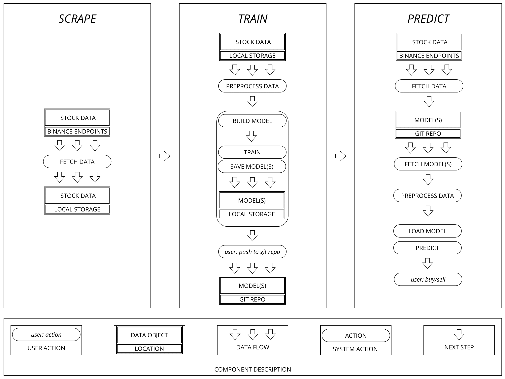

# Prophet: Investment Assistant Neural Network

## Overview

Prophet is a neural network-based system designed to predict stock market trends. It leverages historical data, technical analysis, and machine learning to forecast price movements and assist in investment decisions.

## Usage

Prophet can be run both locally and in cloud environments such as *Google Colab*. The project includes two Jupyter notebooks:

- `train.ipynb`: Use this notebook to train the model.  
- `predict.ipynb`: Use this notebook for making predictions.

After training, you can push the trained models to your private repository and utilize them for prediction.

## Components

### Scrape

The scraper fetches stock data from the Binance API. It supports daily and monthly data retrieval, features multi-threaded downloading for improved performance, and optionally verifies file checksums for data integrity.

### Train

The training component consists of two main classes: `Preprocessor` and `Trainer`.

- `Preprocessor` loads and prepares data with technical indicators, creates target variables, splits datasets, and applies scaling and PCA for dimensionality reduction.
- `Trainer` builds and trains the neural network model, implements early stopping to prevent overfitting, evaluates the model on test data, and saves the trained model along with its configuration.

### Predict

The prediction component downloads real-time market data, preprocesses it consistently with the training data, loads the trained model, makes predictions, and reports results including target prices.

## Flowchart

## Contributing

Contributions to this project are welcome! Please follow these steps:

1. Fork the repository
2. Create a new branch (`git checkout -b feature/YourFeature`)
3. Make your changes and commit them (`git commit -m 'Add some YourFeature'`)
4. Push to the branch (`git push origin feature/YourFeature`)
5. Open a Pull Request

## License

This project is licensed under the MIT License - see the [LICENSE](LICENSE) file for details.

## Disclaimer

The information and predictions provided by this project are for educational and informational purposes only, and should not be considered as financial advice. The use of any information or data contained in this project is at the user's own risk, and the user is solely responsible for any investment decisions made based on such information or data. The predictions and analysis generated by the neural network are not guaranteed to be accurate. It is always recommended that users conduct their own research and seek professional financial advice before making any investment decisions. The authors of this repo disclaim any and all liability for any losses, damages, or expenses incurred by users as a result of their use of the information or data contained in this project.
